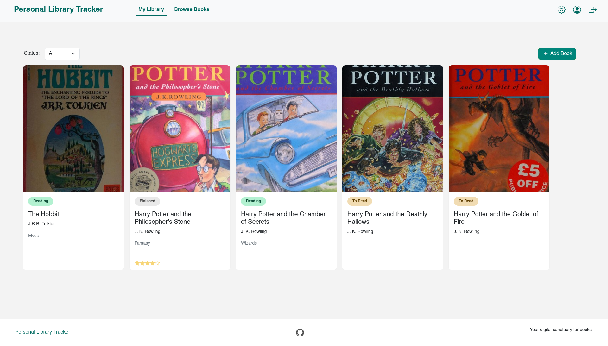
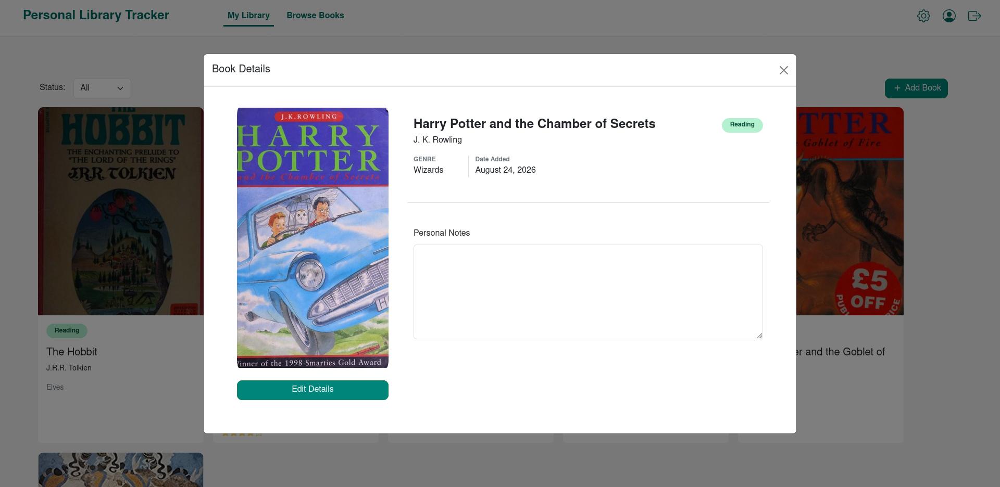
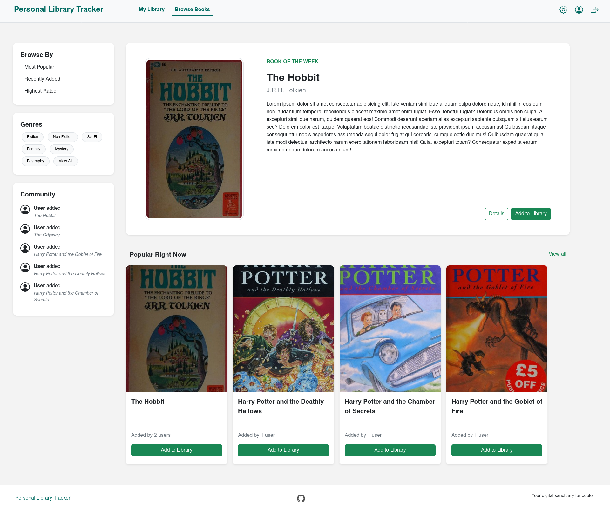

# Library Tracker

A personal library tracker web app built using Blazor.

## Technologies

- <b>Frontend:</b> Blazor WebAssembly, Bootstrap
- <b>Backend:</b> ASP.NET Core Web API
- <b>Database:</b> SQLite
- <b>Authentication:</b> ASP.NET Core Identity
- <b>Third Party API:</b> <a href="https://openlibrary.org/developers/api">Open Library</a>

## Features

- Per-user library tracking
- Book reading status & personal notes
- Uses Open Library's <a href="https://openlibrary.org/dev/docs/api/search">Search</a> & <a href="https://openlibrary.org/dev/docs/api/covers">Covers</a> API

> This project is actively under development. Some features are still being implemented.

## Screenshots

<figure>
    
</figure>

<figure>
    
</figure>

<figure>
    
</figure>